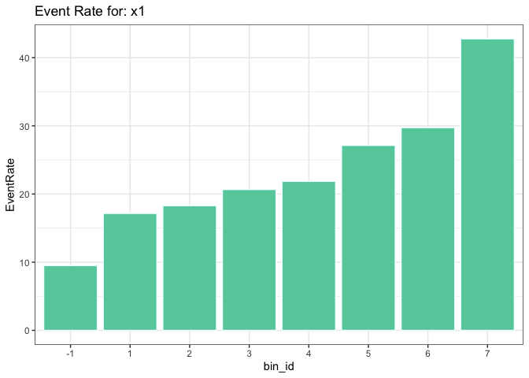

<!-- README.md is generated from README.Rmd. Please edit that file -->
# eda

<!-- badges: start -->
<!-- badges: end -->
## Installation

You can install the pacakge from github using:

``` r
install_github( repo            = "cjodice10/eda"
               ,dependencies    = TRUE
               ,build_vignettes = TRUE)
```

## Example

## Dependencies

There are a few dependencies for this package and they are listed here.

-   dplyr (&gt;= 0.8.5)
-   stringr (&gt;= 1.4.0)
-   tidyr (&gt;= 1.0.2)
-   rlang (&gt;= 0.4.5)

## Why `eda`?

I created this package to help analyst have an easier way of conducting their exploratory data analysis (`eda`) when using R. Historically I've used other products which have really good, some-what automated, EDA tools in their software, but unfortunately these products can be real expensive. So I wanted to create a package that can help others and ease their `eda` process using R. My goal is that this `eda` package will give the analyst a tool to better understand their data and can easily represent some of the outputs to their clients.

This package, as of now, mainly focuses on data sets where the analyst is either modeling a binary response, or a response that reflects count data. This package will explore each attribute in the data by binning and grouping records based on user inputs and the relationship with the dependent variable (DV). For example, it may be that the user wants to force monotonic binning on numeric variables, this package will allow this.

Why bin variables though? Well, depending on your analysis, binning does have it's benefits and at the same time has draw-backs. The biggest draw-back is that when we bin variables to use in models, we naturally lose information, or lose the variability to be explained within the records of the bin. But binning also has benefits. It handles outliers very well, handles missing very well, and more.

Here are the steps we will take using this `eda` package

-   Import the data
-   Summarize the data
-   Split into development and holdout samples
-   Conduct our EDA and understand relationships
-   Apply transformations learned from the EDA
-   Items to consider

This EDA process will bin variables. After the binning process, we then transform the attribute to get a 'weight of evidence' (WOE) for each grouping. This allows us to also calculate how predictive an attribute might be by calculating it's information value (IV). Because we calculate WOE, each variable can be transformed to a WOE value making all variables numeric - to include all missing values! This gives analyst some nice paths to move forward on. When all variables can be translated to a numeric value, one can then take their analysis a step further and cluster variables together. This can help an analyst to understand how each variable correlates to others. Clustering can be an important part of the EDA process, however I do not have that built into this version. I do plan on adding this in future versions - so hang tight.

### Note

-   WOE variables are built such that as the WOE value goes up, the event rate goes down. Therefore, if an analyst is using the transformed WOE variables in their statistical modeling, they should expect negative signs in their parameter estimates.

-   The data set I am using was created by myself and is fitted on an equation. So as you can imagine, the data is in good shape - which in almost all projects is unlikely. In fact, if you plot the raw covariates vs the DV, you will likely get really nice curves. But for the sake of the demonstration on how to use this package, I will stick with this data set.

Let's begin

## Import the data

Let's first begin by bringing in a fake data set called `df_example` that comes with this package We'll also be using `dplyr` and `ggplot2` so we'll bring in those libraries

``` r
#install the package from github if needed
#install_github( repo            = "cjodice10/eda"
#               ,dependencies    = TRUE
#               ,build_vignettes = TRUE)

#attach some packages
library(eda)
library(dplyr,warn.conflicts = FALSE)
library(ggplot2)

#bring in the example dataframe
data("df_example",package="eda")

#look at the structure
str(df_example)
#> 'data.frame':    50000 obs. of  8 variables:
#>  $ x1      : num  0.532 NA 0.717 NA 0.603 ...
#>  $ x2      : num  0.543 0.765 0.132 1.703 0.355 ...
#>  $ x3      : num  -0.272 0.914 0.436 0.914 -0.273 ...
#>  $ x4      : num  0.35638 -0.15404 -1.30016 0.00193 -1.34253 ...
#>  $ target  : num  0 0 0 0 0 0 0 0 1 0 ...
#>  $ cat_var1: chr  "5" NA NA NA ...
#>  $ cat_var2: chr  "5" "8" "1" "17" ...
#>  $ id      : int  1 2 3 4 5 6 7 8 9 10 ...
```

We see that this dataframe `df_example` has 50,000 observations and 8 variables.

-   two categorical variables
-   6 numeric or int variables

Our dependent variable is called `target` and it is a binary response.

## Summarize the data

Our first step is to get a summary of distributions for this data set. We can easily do that with this package. We will use the function `get_percentile()` for a summary on numeric variables and `get_frequency()` for a summary on non-numeric variables. Let's first start with `get_percentile()` We will pass the data frame name and numeric column names to it

``` r
#get a list of numeric variable names
num_vars = names(df_example %>% dplyr::select_if(is.numeric))

#numeric summary
num_summary = get_percentile( df   = df_example
                             ,vars = num_vars)

#show the table
knitr::kable(num_summary)
```

<table style="width:100%;">
<colgroup>
<col width="3%" />
<col width="4%" />
<col width="3%" />
<col width="4%" />
<col width="5%" />
<col width="5%" />
<col width="5%" />
<col width="3%" />
<col width="4%" />
<col width="4%" />
<col width="4%" />
<col width="4%" />
<col width="4%" />
<col width="4%" />
<col width="4%" />
<col width="4%" />
<col width="4%" />
<col width="4%" />
<col width="6%" />
<col width="2%" />
<col width="2%" />
<col width="2%" />
</colgroup>
<thead>
<tr class="header">
<th align="left">Variable</th>
<th align="right">NonMissing</th>
<th align="right">NMissing</th>
<th align="right">PctMissing</th>
<th align="right">UniqueValues</th>
<th align="right">Mean</th>
<th align="right">StDev</th>
<th align="right">Min</th>
<th align="right">P1</th>
<th align="right">P5</th>
<th align="right">P10</th>
<th align="right">Q1</th>
<th align="right">Median</th>
<th align="right">P75</th>
<th align="right">P90</th>
<th align="right">P95</th>
<th align="right">P99</th>
<th align="right">Max</th>
<th align="right">Summation</th>
<th align="right">LT0</th>
<th align="right">ET0</th>
<th align="right">GT0</th>
</tr>
</thead>
<tbody>
<tr class="odd">
<td align="left">x1</td>
<td align="right">26982</td>
<td align="right">23018</td>
<td align="right">46.036</td>
<td align="right">26983</td>
<td align="right">0.7431588</td>
<td align="right">0.6235583</td>
<td align="right">-0.09997</td>
<td align="right">-0.08643</td>
<td align="right">-0.03126</td>
<td align="right">0.03640</td>
<td align="right">0.24653</td>
<td align="right">0.62165</td>
<td align="right">1.11320</td>
<td align="right">1.62346</td>
<td align="right">1.93601</td>
<td align="right">2.56579</td>
<td align="right">3.82114</td>
<td align="right">20051.9119</td>
<td align="right">1975</td>
<td align="right">0</td>
<td align="right">25007</td>
</tr>
<tr class="even">
<td align="left">x2</td>
<td align="right">50000</td>
<td align="right">0</td>
<td align="right">0.000</td>
<td align="right">50000</td>
<td align="right">-0.0027324</td>
<td align="right">0.9976284</td>
<td align="right">-4.06633</td>
<td align="right">-2.33332</td>
<td align="right">-1.64920</td>
<td align="right">-1.28370</td>
<td align="right">-0.67459</td>
<td align="right">-0.00174</td>
<td align="right">0.66909</td>
<td align="right">1.27963</td>
<td align="right">1.63535</td>
<td align="right">2.31506</td>
<td align="right">4.31276</td>
<td align="right">-136.6197</td>
<td align="right">25036</td>
<td align="right">0</td>
<td align="right">24964</td>
</tr>
<tr class="odd">
<td align="left">x3</td>
<td align="right">50000</td>
<td align="right">0</td>
<td align="right">0.000</td>
<td align="right">50000</td>
<td align="right">-0.0061873</td>
<td align="right">0.9986858</td>
<td align="right">-4.11825</td>
<td align="right">-2.33976</td>
<td align="right">-1.65252</td>
<td align="right">-1.28647</td>
<td align="right">-0.68093</td>
<td align="right">-0.00094</td>
<td align="right">0.67014</td>
<td align="right">1.26813</td>
<td align="right">1.62842</td>
<td align="right">2.30447</td>
<td align="right">3.77264</td>
<td align="right">-309.3627</td>
<td align="right">25024</td>
<td align="right">0</td>
<td align="right">24976</td>
</tr>
<tr class="even">
<td align="left">x4</td>
<td align="right">50000</td>
<td align="right">0</td>
<td align="right">0.000</td>
<td align="right">50000</td>
<td align="right">0.0102718</td>
<td align="right">1.0058805</td>
<td align="right">-4.35675</td>
<td align="right">-2.32499</td>
<td align="right">-1.64559</td>
<td align="right">-1.27657</td>
<td align="right">-0.67118</td>
<td align="right">0.01345</td>
<td align="right">0.69598</td>
<td align="right">1.29664</td>
<td align="right">1.65735</td>
<td align="right">2.35011</td>
<td align="right">4.23591</td>
<td align="right">513.5887</td>
<td align="right">24741</td>
<td align="right">0</td>
<td align="right">25259</td>
</tr>
<tr class="odd">
<td align="left">target</td>
<td align="right">50000</td>
<td align="right">0</td>
<td align="right">0.000</td>
<td align="right">2</td>
<td align="right">0.1839400</td>
<td align="right">0.3874391</td>
<td align="right">0.00000</td>
<td align="right">0.00000</td>
<td align="right">0.00000</td>
<td align="right">0.00000</td>
<td align="right">0.00000</td>
<td align="right">0.00000</td>
<td align="right">0.00000</td>
<td align="right">1.00000</td>
<td align="right">1.00000</td>
<td align="right">1.00000</td>
<td align="right">1.00000</td>
<td align="right">9197.0000</td>
<td align="right">0</td>
<td align="right">40803</td>
<td align="right">9197</td>
</tr>
<tr class="even">
<td align="left">id</td>
<td align="right">50000</td>
<td align="right">0</td>
<td align="right">0.000</td>
<td align="right">50000</td>
<td align="right">25000.5000000</td>
<td align="right">14433.9010666</td>
<td align="right">1.00000</td>
<td align="right">500.99000</td>
<td align="right">2500.95000</td>
<td align="right">5000.90000</td>
<td align="right">12500.75000</td>
<td align="right">25000.50000</td>
<td align="right">37500.25000</td>
<td align="right">45000.10000</td>
<td align="right">47500.05000</td>
<td align="right">49500.01000</td>
<td align="right">50000.00000</td>
<td align="right">1250025000.0000</td>
<td align="right">0</td>
<td align="right">0</td>
<td align="right">50000</td>
</tr>
</tbody>
</table>

You will get in return a dataframe with a percentile distribution along with other information like

-   Percent Missing (PctMissing)
-   Number of unique values (UniqueValues)
-   Number of values less than 0 (LT0)
-   Number of values equal to 0 (ET0)
-   Number of values greather than 0 (GT0)

You'll also get the percentile distribution of all numeric variables along with the mean and stdev.

-   You'll notice the event rate is about 18.4% for this data set
-   You can see here that the 'ID' variable uniquely identifies each row. It has 50K unique values. We will be using this throughout.

Next, let's take a look at `get_frequency()` We will pass the data frame name along with non-numeric column names to it. We will also pass 1 more parameter `unique.threshold.pct` This tells the function to only calculate and output the frequency distribution of variables with less than this percent of unique values. Imagine having 10,000 unique levels...this may take long to compute the table() function and it is also not easy to visually look at. The function will return a list of two dataframes:

-   index 1 will hold a dataframe of the frequency distribution for each variable (percent of records in each level)
-   index 2 will hold a dataframe that gives information about the number of unique levels and missing rates

``` r
`%ni%` = Negate(`%in%`)

#get a list of non-numeric variable names
cat_vars = df_example[,colnames(df_example) %ni% num_vars] %>% colnames()

#numeric summary
cat_summary = get_frequency(  df                   = df_example
                             ,vars                 = cat_vars
                             ,unique.threshold.pct = 0.8)

#take a look at the structure
str(cat_summary)
#> List of 2
#>  $ :'data.frame':    58 obs. of  5 variables:
#>   ..$ Variable : chr [1:58] "cat_var1" "cat_var1" "cat_var1" "cat_var1" ...
#>   ..$ Level    : chr [1:58] "-1" "0" "1" "2" ...
#>   ..$ Frequency: int [1:58] 980 1975 1973 1887 1870 1813 1811 1646 788 35257 ...
#>   ..$ Percent  : num [1:58] 1.96 3.95 3.95 3.77 3.74 ...
#>   ..$ Uniques  : int [1:58] NA NA NA NA NA NA NA NA NA NA ...
#>  $ :'data.frame':    2 obs. of  5 variables:
#>   ..$ Variable    : chr [1:2] "cat_var1" "cat_var2"
#>   ..$ NonMissing  : int [1:2] 14743 34577
#>   ..$ NMissing    : int [1:2] 35257 15423
#>   ..$ PctMissing  : num [1:2] 70.5 30.8
#>   ..$ UniqueValues: int [1:2] 10 48

#extract dataframe from first index
cat_summary_frequencies = cat_summary[[1]]

#look at the first few records of index 1
knitr::kable(cat_summary_frequencies[1:10,])
```

| Variable  | Level |  Frequency|  Percent|  Uniques|
|:----------|:------|----------:|--------:|--------:|
| cat\_var1 | -1    |        980|    1.960|       NA|
| cat\_var1 | 0     |       1975|    3.950|       NA|
| cat\_var1 | 1     |       1973|    3.946|       NA|
| cat\_var1 | 2     |       1887|    3.774|       NA|
| cat\_var1 | 3     |       1870|    3.740|       NA|
| cat\_var1 | 4     |       1813|    3.626|       NA|
| cat\_var1 | 5     |       1811|    3.622|       NA|
| cat\_var1 | 6     |       1646|    3.292|       NA|
| cat\_var1 | 7     |        788|    1.576|       NA|
| cat\_var1 | NA    |      35257|   70.514|       NA|

Let's also look at the dataframe stored in the second index of `cat_summary`

``` r
#extract dataframe from second index
cat_summary_missing_rates = cat_summary[[2]]

#look at the table
knitr::kable(cat_summary_missing_rates)
```

| Variable  |  NonMissing|  NMissing|  PctMissing|  UniqueValues|
|:----------|-----------:|---------:|-----------:|-------------:|
| cat\_var1 |       14743|     35257|      70.514|            10|
| cat\_var2 |       34577|     15423|      30.846|            48|

This dataframe can be combined with the `num_summary` output to get a complete view of all variables and their unique values and missing rates.

``` r
#combine
var_summary = bind_rows(num_summary[,1:5],cat_summary_missing_rates)

#look at the table
knitr::kable(var_summary)
```

| Variable  |  NonMissing|  NMissing|  PctMissing|  UniqueValues|
|:----------|-----------:|---------:|-----------:|-------------:|
| x1        |       26982|     23018|      46.036|         26983|
| x2        |       50000|         0|       0.000|         50000|
| x3        |       50000|         0|       0.000|         50000|
| x4        |       50000|         0|       0.000|         50000|
| target    |       50000|         0|       0.000|             2|
| id        |       50000|         0|       0.000|         50000|
| cat\_var1 |       14743|     35257|      70.514|            10|
| cat\_var2 |       34577|     15423|      30.846|            48|

## Split into development and holdout samples

For our next step, let's quickly split the data by taking a 70/30 random sample for a development and a holdout set

``` r
#sample size
sample_size = floor(0.70 * nrow(df_example))

#for reproducibility
set.seed(1234)
dev_ind = sample(seq_len(nrow(df_example)), size = sample_size)

df_example_dev      = df_example[dev_ind, ]
df_example_holdout  = df_example[-dev_ind, ]
```

The analyst should also re-run the functions we went over above on the development sample to ensure things look OK. But we will move forward

## Conduct our EDA and understand relationships

Let's push the data through the `process_pipeline()` function. We are expecting this to return several pieces of information in a list. A lot of the defaults are already set for this function. To make this run correctly, ensure that your dependent variable (DV) is numeric. Our DV is called `target` and we set the `dv_type` parameter below to 'Binary' because we are predicting a binary response. This eda package only works for when the DV represents a binary input (1/0) or a count (frequency with possible exposure). To understand more about the inputs of the function `process_pipeline`, just execute the command `?process_pipeline`

``` r

#begin binning
my_eda = process_pipeline( run_id           = 'MyRun1'
                          ,df               = df_example_dev
                          ,unique_id_var    = "id"
                          ,dv_var           = "target"
                          ,dv_type          = "Binary"
                          ,var_list         = c("x1","x2","x3","x4","cat_var1","cat_var2")
                          ,num_nbins        = 20
                          ,num_min_pct      = 0.05
                          ,num_monotonic    = TRUE
                          ,cat_min_pct      = 0.05
                          ,eda_tracking     = TRUE
                          ,path_2_save      = "/Users/jodicefamily/Rprojects/Testing"
)
#> 
#> -------------------------------------
#> 
#> Binning numeric variables...
#> 
#> Checking inputs...
#> Variable: x1
#> [1] "Looping through because minimum percent threshold is not met..."
#> 
#> Variable: x2
#> [1] "Looping through because minimum percent threshold is not met..."
#> [1] "Looping through because DV is not monotonic..."
#> 
#> Variable: x3
#> [1] "Looping through because minimum percent threshold is not met..."
#> 
#> Variable: x4
#> [1] "Looping through because minimum percent threshold is not met..."
#> [1] "Looping through because DV is not monotonic..."
#> 
#> 
#> Completed numeric binning!
#> 
#> -------------------------------------
#> 
#> 
#> -------------------------------------
#> 
#> Binning categorical variables...
#> 
#> Checking inputs...
#> Variable: cat_var1
#> Number of initial levels: 9
#> Completed Binning Variable : cat_var1
#> 
#> Variable: cat_var2
#> Number of initial levels: 45
#> Completed Binning Variable : cat_var2
#> 
#> 
#> Completed categorical binning!
#> 
#> -------------------------------------
#> 
#> Saving outputs to: /Users/jodicefamily/Rprojects/Testing
#> 
#> Saved Numeric_eda to: /Users/jodicefamily/Rprojects/Testing/MyRun1-Numeric_eda.csv
#> Saved numeric_iv to: /Users/jodicefamily/Rprojects/Testing/MyRun1-numeric_iv.csv
#> Saved numeric_logics to: /Users/jodicefamily/Rprojects/Testing/MyRun1-numeric_logics.csv
#> 
#> Saved CategoricalEDA to: /Users/jodicefamily/Rprojects/Testing/MyRun1-CategoricalEDA.csv
#> Saved categorical_iv to: /Users/jodicefamily/Rprojects/Testing/MyRun1-categorical_iv.csv
#> Saved categorical_logics to: /Users/jodicefamily/Rprojects/Testing/MyRun1-categorical_logics.csv
#> 

#let's look at the names
names(my_eda)
#> [1] "Numeric_eda"        "numeric_iv"         "numeric_logics"    
#> [4] "CategoricalEDA"     "categorical_iv"     "categorical_logics"
#> [7] "params"

#you can also look at the structure if needed - but we will review below
#str(my_eda)
```

First you'll notice that as the algorithm is processing, it gives you some tracking information. It tells you which variable it is at along with what it is doing. Example `Looping through because minimum percent threshold is not met...`. This information is output because our `eda_tracking` parameter is set to TRUE. If we set it to FALSE, this information will not show.

The notes also tell us where some files are saved that may be useful for the user to export and possibly send to their clients, bring those tables into a PPT, or just to have on file for record.

Another interesting feature for this `eda` package is that it creates a file(s) within the `path_2_save` suffixed with `*_log_file.txt`. It tracks when bins are being merged so the user can see reasons why. This file creation may need more work, but it is a start. I want to give the user transparency into why the algorithm is deciding to merge bins together. These files will be created only if `eda_tracking` is set to TRUE.

The output has produced several tables with quite a bit of information. Let's first see the table it produced called `Numeric_eda` - but subset it to where `Variable  == 'x1'`.

``` r
num_eda = my_eda$Numeric_eda

#look at variable x1
num_eda_subset = num_eda[which(num_eda$Variable=="x1"),]
num_eda_subset$bin_id = as.factor(num_eda_subset$bin_id)
knitr::kable(num_eda_subset,row.names = FALSE)
```

| Variable | bin\_id |  UpperBound|  PctRecords|  Records|  Exposure|  Events|  EventRate|      WOE|  GRP|
|:---------|:--------|-----------:|-----------:|--------:|---------:|-------:|----------:|--------:|----:|
| x1       | -1      |          NA|   0.4576286|    16017|     16017|    1523|   9.508647|   0.7846|   -1|
| x1       | 1       |   0.0960389|   0.0768000|     2688|      2688|     461|  17.150300|   0.1065|    1|
| x1       | 2       |   0.2921437|   0.0756286|     2647|      2647|     484|  18.284900|   0.0287|    2|
| x1       | 3       |   0.4881943|   0.0709429|     2483|      2483|     513|  20.660500|  -0.1230|    3|
| x1       | 4       |   0.6841690|   0.0656286|     2297|      2297|     502|  21.854600|  -0.1943|    4|
| x1       | 5       |   0.8801719|   0.0570857|     1998|      1998|     542|  27.127100|  -0.4803|    5|
| x1       | 6       |   1.2723105|   0.0902286|     3158|      3158|     939|  29.734000|  -0.6085|    6|
| x1       | 7       |   3.8211372|   0.1060571|     3712|      3712|    1587|  42.753200|  -1.1766|    7|

If one wanted to, this table can be used to create graphs to show the relationship with each variable and the DV. It's a nice way of easily displaying the data. Below, we'll easily display the relationship with the new variable and the percent of records in each bin (or grouping)

``` r
#now plot the event rate
ggplot(num_eda_subset,aes(x=bin_id,y=EventRate)) +
  geom_bar(stat="identity",color="azure", fill="aquamarine3")+
  scale_x_discrete( name   = "bin_id"
                   ,limits = sort(num_eda_subset$bin_id))+
  theme_bw()+
  labs(title="Event Rate for: x1")

#now plot the percent records
ggplot(num_eda_subset,aes(x=bin_id,y=PctRecords)) +
  geom_bar(stat="identity",color="white", fill="steelblue")+
  scale_x_discrete( name   = "bin_id"
                   ,limits = sort(num_eda_subset$bin_id))+
  theme_bw()+
  labs(title="% of Records")
```



Let's now subset to a categorical variable and see the relationship. Categorical variables may have two GRP labels with inputs of -9999 and/or -8888

-   -9999 means that this is the missing bin. These inputs were NA or simply blank
-   -8888 means that all inputs in this bin were below a threshold in terms of % of records and they were all clubbed together. The default threshold is 0.005. This can be changed in the parameter `bin_random_together` within the `process_pipeline()` function

``` r
cat_eda = my_eda$CategoricalEDA

#look at variable x1
cat_eda_subset = cat_eda[which(cat_eda$Variable=="cat_var2"),]
cat_eda_subset$GRP = as.factor(cat_eda_subset$GRP)
knitr::kable(cat_eda_subset,row.names = FALSE)
```

<table style="width:100%;">
<colgroup>
<col width="5%" />
<col width="55%" />
<col width="6%" />
<col width="5%" />
<col width="5%" />
<col width="4%" />
<col width="6%" />
<col width="5%" />
<col width="4%" />
</colgroup>
<thead>
<tr class="header">
<th align="left">Variable</th>
<th align="left">bin_id</th>
<th align="right">PctRecords</th>
<th align="right">Records</th>
<th align="right">Exposure</th>
<th align="right">Events</th>
<th align="right">EventRate</th>
<th align="right">WOE</th>
<th align="left">GRP</th>
</tr>
</thead>
<tbody>
<tr class="odd">
<td align="left">cat_var2</td>
<td align="left">'NA'</td>
<td align="right">0.3100571</td>
<td align="right">10852</td>
<td align="right">10852</td>
<td align="right">1787</td>
<td align="right">0.1646701</td>
<td align="right">0.1554</td>
<td align="left">-9999</td>
</tr>
<tr class="even">
<td align="left">cat_var2</td>
<td align="left">'37','30','26','25','29','31','32','35','22','23','27','28','24','21','33','34','38','41','43'</td>
<td align="right">0.0192000</td>
<td align="right">672</td>
<td align="right">672</td>
<td align="right">161</td>
<td align="right">0.2395833</td>
<td align="right">-0.3135</td>
<td align="left">-8888</td>
</tr>
<tr class="odd">
<td align="left">cat_var2</td>
<td align="left">'-5','-2'</td>
<td align="right">0.0564571</td>
<td align="right">1976</td>
<td align="right">1976</td>
<td align="right">327</td>
<td align="right">0.1654858</td>
<td align="right">0.1495</td>
<td align="left">1</td>
</tr>
<tr class="even">
<td align="left">cat_var2</td>
<td align="left">'-4','1'</td>
<td align="right">0.0782571</td>
<td align="right">2739</td>
<td align="right">2739</td>
<td align="right">479</td>
<td align="right">0.1748813</td>
<td align="right">0.0829</td>
<td align="left">2</td>
</tr>
<tr class="odd">
<td align="left">cat_var2</td>
<td align="left">'-3','7'</td>
<td align="right">0.0684286</td>
<td align="right">2395</td>
<td align="right">2395</td>
<td align="right">453</td>
<td align="right">0.1891441</td>
<td align="right">-0.0129</td>
<td align="left">3</td>
</tr>
<tr class="even">
<td align="left">cat_var2</td>
<td align="left">'9','2','0'</td>
<td align="right">0.1071714</td>
<td align="right">3751</td>
<td align="right">3751</td>
<td align="right">718</td>
<td align="right">0.1914156</td>
<td align="right">-0.0277</td>
<td align="left">4</td>
</tr>
<tr class="odd">
<td align="left">cat_var2</td>
<td align="left">'-1','15'</td>
<td align="right">0.0533143</td>
<td align="right">1866</td>
<td align="right">1866</td>
<td align="right">364</td>
<td align="right">0.1950697</td>
<td align="right">-0.0511</td>
<td align="left">5</td>
</tr>
<tr class="even">
<td align="left">cat_var2</td>
<td align="left">'5','6','19'</td>
<td align="right">0.0736571</td>
<td align="right">2578</td>
<td align="right">2578</td>
<td align="right">509</td>
<td align="right">0.1974399</td>
<td align="right">-0.0661</td>
<td align="left">6</td>
</tr>
<tr class="odd">
<td align="left">cat_var2</td>
<td align="left">'4','18','17'</td>
<td align="right">0.0532000</td>
<td align="right">1862</td>
<td align="right">1862</td>
<td align="right">383</td>
<td align="right">0.2056928</td>
<td align="right">-0.1174</td>
<td align="left">7</td>
</tr>
<tr class="even">
<td align="left">cat_var2</td>
<td align="left">'11','10','8','16','14','12'</td>
<td align="right">0.1194857</td>
<td align="right">4182</td>
<td align="right">4182</td>
<td align="right">887</td>
<td align="right">0.2120995</td>
<td align="right">-0.1562</td>
<td align="left">8</td>
</tr>
<tr class="odd">
<td align="left">cat_var2</td>
<td align="left">'20','13','3'</td>
<td align="right">0.0607714</td>
<td align="right">2127</td>
<td align="right">2127</td>
<td align="right">483</td>
<td align="right">0.2270804</td>
<td align="right">-0.2436</td>
<td align="left">9</td>
</tr>
</tbody>
</table>

Let's also plot it

``` r
#now plot the event rate
ggplot(cat_eda_subset,aes(x=GRP,y=EventRate)) +
  geom_bar(stat="identity",color="azure", fill="aquamarine3")+
  scale_x_discrete( name   = "GRP" 
                   ,limits = cat_eda_subset$GRP)+
  theme_bw()+
  labs(title="Event Rate for: cat_var2")

#now plot the percent records
ggplot(cat_eda_subset,aes(x=GRP,y=PctRecords)) +
  geom_bar(stat="identity",color="white", fill="steelblue")+
  scale_x_discrete( name   = "GRP"
                   ,limits = cat_eda_subset$GRP)+
  theme_bw()+
  labs(title="% of Records")
```


### Variable ranking

We can rank variables and their predictive power by looking at their information values (IV). This can be extracted from the output of the `process_pipeline()` we recently ran and assigned it to `my_eda`. The names are called:

-   numeric\_iv
-   categorical\_iv

Let's combine them together and then plot it to get a good view

``` r
ivs = bind_rows(my_eda$numeric_iv,my_eda$categorical_iv) %>% arrange(desc(IV)) %>% data.frame()

#now plot the event rate
ivs %>%
  arrange(desc(IV)) %>%
  mutate(Variable=factor(Variable, levels=Variable)) %>%
  ggplot(aes(x=Variable,y=IV)) +
  geom_bar(stat="identity",color="azure", fill="aquamarine3")+
  theme_bw()+
  labs(title="Variable Ranking using IV's")
```


Above, we see that the variable 'x4' has the highest predictive power with a very large IV ... IV's fairly large like this would be considered 'suspicous' but that is a topic we won't dive into here. We will keep moving forward for demonstration purposes.

Using this, an analyst can set a minimum threshold on the IV to begin to remove variables if needed. This still leaves the case of collinearity amongst other attributes. This is where clustering will be helpful, but again we won't be discussing that here.

### Variable logic for new data set

We also see as an output table suffixed by `*_logics`. This is used to apply these transformations to your train data, test data and if used in production. User can either apply `woe` logic, `grp` logic or both. `grp` logic is just transforming the original variables to a 'group'. If the analyst applies the `grp` logic to a data set and builds a model, they should use these transformed `grp` attributes as categorical, not numeric in their model. Let's take a look at some of these logics.

``` r
numeric_logics = my_eda$numeric_logics

#look at variable x1
numeric_logics_subset = numeric_logics[which(numeric_logics$Variable=="x1"),]
knitr::kable(numeric_logics_subset,row.names = FALSE)
```

<table>
<colgroup>
<col width="11%" />
<col width="41%" />
<col width="47%" />
</colgroup>
<thead>
<tr class="header">
<th align="left">Variable</th>
<th align="left">grp_logic_2_use</th>
<th align="left">woe_logic_2_use</th>
</tr>
</thead>
<tbody>
<tr class="odd">
<td align="left">x1</td>
<td align="left">if is.na(x1) then -1</td>
<td align="left">if is.na(x1) then 0.7846</td>
</tr>
<tr class="even">
<td align="left">x1</td>
<td align="left">if x1 &lt;= 0.0960388905610497 then 1</td>
<td align="left">if x1 &lt;= 0.0960388905610497 then 0.1065</td>
</tr>
<tr class="odd">
<td align="left">x1</td>
<td align="left">if x1 &lt;= 0.292143711088896 then 2</td>
<td align="left">if x1 &lt;= 0.292143711088896 then 0.0287</td>
</tr>
<tr class="even">
<td align="left">x1</td>
<td align="left">if x1 &lt;= 0.488194332449186 then 3</td>
<td align="left">if x1 &lt;= 0.488194332449186 then -0.123</td>
</tr>
<tr class="odd">
<td align="left">x1</td>
<td align="left">if x1 &lt;= 0.684168993870779 then 4</td>
<td align="left">if x1 &lt;= 0.684168993870779 then -0.1943</td>
</tr>
<tr class="even">
<td align="left">x1</td>
<td align="left">if x1 &lt;= 0.880171909757078 then 5</td>
<td align="left">if x1 &lt;= 0.880171909757078 then -0.4803</td>
</tr>
<tr class="odd">
<td align="left">x1</td>
<td align="left">if x1 &lt;= 1.27231053725892 then 6</td>
<td align="left">if x1 &lt;= 1.27231053725892 then -0.6085</td>
</tr>
<tr class="even">
<td align="left">x1</td>
<td align="left">if x1 &gt; 1.27231053725892 then 7</td>
<td align="left">if x1 &gt; 1.27231053725892 then -1.1766</td>
</tr>
</tbody>
</table>

``` r
cat_logics = my_eda$categorical_logics

#look at variable cat_var2
cat_logics_subset = cat_logics[which(cat_logics$Variable=="cat_var2"),]
knitr::kable(cat_logics_subset,row.names = FALSE)
```

<table>
<colgroup>
<col width="3%" />
<col width="47%" />
<col width="48%" />
</colgroup>
<thead>
<tr class="header">
<th align="left">Variable</th>
<th align="left">grp_logic_2_use</th>
<th align="left">woe_logic_2_use</th>
</tr>
</thead>
<tbody>
<tr class="odd">
<td align="left">cat_var2</td>
<td align="left">if is.na(cat_var2) then -9999</td>
<td align="left">if is.na(cat_var2) then 0.1554</td>
</tr>
<tr class="even">
<td align="left">cat_var2</td>
<td align="left">if cat_var2 %in% c('37','30','26','25','29','31','32','35','22','23','27','28','24','21','33','34','38','41','43') then -8888</td>
<td align="left">if cat_var2 %in% c('37','30','26','25','29','31','32','35','22','23','27','28','24','21','33','34','38','41','43') then -0.3135</td>
</tr>
<tr class="odd">
<td align="left">cat_var2</td>
<td align="left">if cat_var2 %in% c('-5','-2') then 1</td>
<td align="left">if cat_var2 %in% c('-5','-2') then 0.1495</td>
</tr>
<tr class="even">
<td align="left">cat_var2</td>
<td align="left">if cat_var2 %in% c('-4','1') then 2</td>
<td align="left">if cat_var2 %in% c('-4','1') then 0.0829</td>
</tr>
<tr class="odd">
<td align="left">cat_var2</td>
<td align="left">if cat_var2 %in% c('-3','7') then 3</td>
<td align="left">if cat_var2 %in% c('-3','7') then -0.0129</td>
</tr>
<tr class="even">
<td align="left">cat_var2</td>
<td align="left">if cat_var2 %in% c('9','2','0') then 4</td>
<td align="left">if cat_var2 %in% c('9','2','0') then -0.0277</td>
</tr>
<tr class="odd">
<td align="left">cat_var2</td>
<td align="left">if cat_var2 %in% c('-1','15') then 5</td>
<td align="left">if cat_var2 %in% c('-1','15') then -0.0511</td>
</tr>
<tr class="even">
<td align="left">cat_var2</td>
<td align="left">if cat_var2 %in% c('5','6','19') then 6</td>
<td align="left">if cat_var2 %in% c('5','6','19') then -0.0661</td>
</tr>
<tr class="odd">
<td align="left">cat_var2</td>
<td align="left">if cat_var2 %in% c('4','18','17') then 7</td>
<td align="left">if cat_var2 %in% c('4','18','17') then -0.1174</td>
</tr>
<tr class="even">
<td align="left">cat_var2</td>
<td align="left">if cat_var2 %in% c('11','10','8','16','14','12') then 8</td>
<td align="left">if cat_var2 %in% c('11','10','8','16','14','12') then -0.1562</td>
</tr>
<tr class="odd">
<td align="left">cat_var2</td>
<td align="left">if cat_var2 %in% c('20','13','3') then 9</td>
<td align="left">if cat_var2 %in% c('20','13','3') then -0.2436</td>
</tr>
</tbody>
</table>

## Apply transformations learned from the EDA

The `process_pipeline()` function just created groupings for each varaible, however it has not applied those groupings to any data just yet. To apply these transformation to the development, holdout and more data sets, we can simply use the `apply_numeric_logic()` function for numeric variables and `apply_categorical_logic` to non-numeric varaibles. Let's go ahead an apply the transformations so we can see how. We will pass into the function the dataset we want to transform `main_df`, the numeric logic, a unique id variable and the transformations we want (either `woe` or `grp` or both). In this case we will use `woe`

``` r
numeric_logics = my_eda$numeric_logics

num_transformed_df = apply_numeric_logic(  main_df       = df_example_dev
                                          ,logic_df      = numeric_logics
                                          ,unique_key_id = "id"
                                          ,logic_type    = "woe") #c("woe","grp")
#> transforming varaible x1
#> transforming varaible x2
#> transforming varaible x3
#> transforming varaible x4

#look at a summary
summary(num_transformed_df)
#>        id            woe_x1            woe_x2              woe_x3        
#>  Min.   :    1   Min.   :-1.1766   Min.   :-0.188700   Min.   :-0.40520  
#>  1st Qu.:12474   1st Qu.:-0.4803   1st Qu.:-0.077000   1st Qu.:-0.13320  
#>  Median :24982   Median : 0.1065   Median :-0.039100   Median :-0.02060  
#>  Mean   :24982   Mean   : 0.1408   Mean   : 0.005005   Mean   : 0.01677  
#>  3rd Qu.:37483   3rd Qu.: 0.7846   3rd Qu.: 0.115800   3rd Qu.: 0.19020  
#>  Max.   :49999   Max.   : 0.7846   Max.   : 0.243200   Max.   : 0.39390  
#>      woe_x4       
#>  Min.   :-2.5038  
#>  1st Qu.: 0.0885  
#>  Median : 0.3330  
#>  Mean   : 0.4483  
#>  3rd Qu.: 0.4902  
#>  Max.   : 5.3126
```

You'll notice that this data set includes all records, but now only has the transformed `woe` attributes based on only the original numeric fields.

What should the user look out for? If a numeric variable in the development sample does not have missing values, then the `numeric_logics` will not account for missing because it does not know how to treat it. The user should always run a `summary()` to ensure no record has a missing transformation value. The user can then assign missing values an actual `woe` or `grp` value based on their preference.

We will call the `apply_categorical_logic()` on the non-numeric attributes now

``` r
categorical_logics = my_eda$categorical_logics

cat_transformed_df = apply_categorical_logic(  main_df       = df_example_dev
                                              ,logic_df      = categorical_logics
                                              ,unique_key_id = "id"
                                              ,logic_type    = "woe") #c("woe","grp")
#> transforming varaible cat_var1
#> transforming varaible cat_var2

#look at a summary
summary(cat_transformed_df)
#>        id         woe_cat_var1        woe_cat_var2      
#>  Min.   :    1   Min.   :-0.180300   Min.   :-0.313500  
#>  1st Qu.:12474   1st Qu.: 0.017800   1st Qu.:-0.117400  
#>  Median :24982   Median : 0.017800   Median :-0.012900  
#>  Mean   :24982   Mean   : 0.001521   Mean   : 0.005934  
#>  3rd Qu.:37483   3rd Qu.: 0.017800   3rd Qu.: 0.155400  
#>  Max.   :49999   Max.   : 0.131000   Max.   : 0.155400
```

What should the user look out for? If a categorical variable in the development sample does not have missing values or does not have a level represented in the holdout or future data sets, then the `categorical_logics` will not account for this because it does not know how to treat it. The user should always run a `summary()` to ensure no record has a missing transformation value. The user can then assign missing values an actual `woe` or `grp` value based on their preference. Although not shown here, what is nice about the `apply_categorical_logic` is that if it see's a new level in a data set that it is not expecting, it will send a message to the user in the console alerting which variables had new values it wasn't expecting

Let's move on. Now, we've told the function that the `unique_key_id` in our data set is the 'id' field. We can now merge the two transformed data sets together. We will also have to perform another merge to get the DV.

``` r
#merge transformed data together
df_analytic_dev = merge(  x     = num_transformed_df
                         ,y     = cat_transformed_df
                         ,by.x  = c("id")
                         ,by.y  = c("id")
                         ,all.x = TRUE
                         ,all.y = TRUE)

#now get the DV from original dev sample
df_analytic_dev = merge(  x     = df_analytic_dev
                         ,y     = df_example_dev[,c("id","target")]
                         ,by.x  = c("id")
                         ,by.y  = c("id")
                         ,all.x = TRUE
                         ,all.y = TRUE)


#look at a summary
summary(df_analytic_dev)
#>        id            woe_x1            woe_x2              woe_x3        
#>  Min.   :    1   Min.   :-1.1766   Min.   :-0.188700   Min.   :-0.40520  
#>  1st Qu.:12474   1st Qu.:-0.4803   1st Qu.:-0.077000   1st Qu.:-0.13320  
#>  Median :24982   Median : 0.1065   Median :-0.039100   Median :-0.02060  
#>  Mean   :24982   Mean   : 0.1408   Mean   : 0.005005   Mean   : 0.01677  
#>  3rd Qu.:37483   3rd Qu.: 0.7846   3rd Qu.: 0.115800   3rd Qu.: 0.19020  
#>  Max.   :49999   Max.   : 0.7846   Max.   : 0.243200   Max.   : 0.39390  
#>      woe_x4         woe_cat_var1        woe_cat_var2           target      
#>  Min.   :-2.5038   Min.   :-0.180300   Min.   :-0.313500   Min.   :0.0000  
#>  1st Qu.: 0.0885   1st Qu.: 0.017800   1st Qu.:-0.117400   1st Qu.:0.0000  
#>  Median : 0.3330   Median : 0.017800   Median :-0.012900   Median :0.0000  
#>  Mean   : 0.4483   Mean   : 0.001521   Mean   : 0.005934   Mean   :0.1872  
#>  3rd Qu.: 0.4902   3rd Qu.: 0.017800   3rd Qu.: 0.155400   3rd Qu.:0.0000  
#>  Max.   : 5.3126   Max.   : 0.131000   Max.   : 0.155400   Max.   :1.0000
```

## Items to consider

-   If the analyst is forcing monotonic binning on numeric attributes, you may get an information value that is really low if the attribute truely has a non-monotonic relationship with the DV. Picture a U-shaped relationship. A linear correlation on a U-shaped relationship will be near 0.
-   At this point, the algorithm cannot run both monotonic==TRUE and FALSE in the same run. If the analyst wants to check both, it will have to be two separate runs (use the `run_id` parameter to specify differnt runs)
-   For categorical data with text as inputs. I would remove any comma's, quotation marks and escape characters before using this package.
-   Setting the initial `num_nbins` to something large (say 200 or 300) with `num_monotonic` = TRUE and a high `num_min_pct` may be innefficient.
-   When applying the logics to a new data set and there are values within categorical fields that are new (were not in the development sample), it will be missing. User needs to apply their own transformation. Some guidance - if user is using `woe` transformations, then consider giving those records a woe\_<variable> value of 0. If user is using `grp` transformation, then consider giving those records a grp\_<variable> value that reflects the average event rate...user has to manually see for each variable, which is the downside for unforeseen values when using `grp`. Similarly for numeric attributes. This will happen to numeric attributes only for missing values. If there are no missing values in the development sample but there are in other data sets, user can follow similar guidance above.
